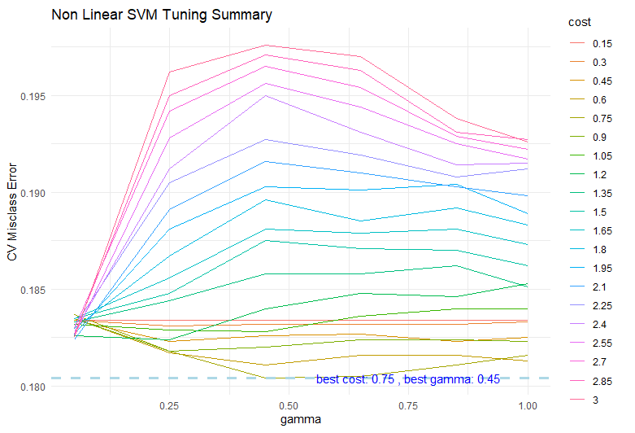
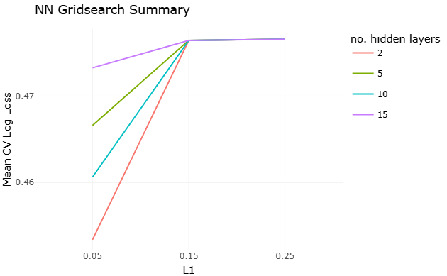

```{r lib_read, eval=T, echo=F}
#| message: false
#| warning: false
library(dplyr)
library(knitr)
library(plotly)
library(ggplot2)
library(ggpubr)
library(lubridate)
library(zoo)
library(tidyverse)
library(GGally)
library(modelsummary)
library(stargazer)
library(gtsummary)
library(patchwork)
library(glmnet)
library(lmridge)
library(tidyr)
library(caret)
library(dplyr)
library(interactions)
library(kableExtra)
library(patchwork) 
library(knitr)
library(broom)
library(car)
library(maps)
library(RColorBrewer)
library(tree)
library(sf)
library(rnaturalearth)
library(rnaturalearthdata)
library(ranger)
library(randomForest)
library(gbm)
library(Metrics)
library(lattice)
library(PRROC)
library(yardstick)
library(ROCR)
library(readr)
library(e1071)
```

# Problem Statement

A new competitor in the private residential market is interested in the Airbnb market in Cape Town and would like an analysis on the key predictors of demand of/ availability of Airbnbs. Demand in this case is proxied by the target variable, fully_booked_30, which is a binary variable that populates 1 if the Airbnb is fully booked in the next 30 days and 0 if not. This is done by using and comparing the classification metrics across 3 classification models namely:

-   SVM with a linear kernel

-   SVM with a radial kernel

-   Feed-forward Neural Network

The insight will serve as a basis to gauge if there is viable demand for the competitor to enter the market.

10-fold cross-validation was used to train all the models, each with its own set of hyperparameters. The summary of the best-performing model for each is then selected and presented, along with a plot of the average CV metric across hyperparameter combinations.

# Exploratory Analysis

The data is highly imbalanced in favour of the negative class. Since the modelling aims to predict availability, this will be treated as the positive class in modelling- this is the target class.

The data used was listings data containing key attributes across Airbnb IDs.

```{r data_read, eval=T, echo=F}
#| message: false
#| warning: false
#| 
listings_data<- read_csv("listings (1).csv")

listings_data_cleaned=listings_data %>% mutate(host_since=lubridate::ymd(host_since),
                         host_response_time=factor(host_response_time,levels=c("within an hour","within a few hours","within a day", "a few days or more")),
                         host_is_superhost=factor(host_is_superhost,levels=c('TRUE','FALSE')),
                         room_type=factor(room_type,levels=unique(listings_data$room_type)),
                         instant_bookable=factor(instant_bookable,level=c('TRUE','FALSE')),
                         fully_booked_30=factor(fully_booked_30, levels=c('yes','no')),
                         host_verifications=factor(case_when(host_verifications %in% c("['phone']") ~'phone_only',
                                                      host_verifications %in% c("['email', 'phone']" ,"['email', 'phone', 'work_email']", "['phone', 'work_email']") ~'phone_email',
                                                      host_verifications %in% c("['email']") ~'email_only'
                           
                         ),levels=c('phone_only','phone_email','email_only'))
                         
                         
                         )


fixed_month_str=ymd("2026-05-01")
fixed_month=floor_date(fixed_month_str,unit='month')

listings_data_cleaned$host_since_months_int =listings_data_cleaned %>% mutate(host_since=ymd(host_since)  ) %>% 
  mutate(host_since_trunc=floor_date(host_since,unit='month')) %>% 
  
  mutate(host_since_months_int= interval(host_since_trunc,fixed_month) %/% months(1) ) %>% 
  
  mutate(current_date= floor_date( today(),unit='month' ) ) %>% 
  
  dplyr::select(host_since_trunc,host_since_months_int,current_date ) %>%
  
  pull(host_since_months_int)

 # create intervals for EDA purposes
a=listings_data_cleaned %>% mutate(host_since_intervals=  cut(host_since_months_int, breaks=c(0,48,96,114,197),labels = c("0-2 yrs", "2-4 yrs", "4-6 yrs",'6+ yrs') )) %>% 
  group_by(host_since_intervals,fully_booked_30) %>% 
  summarize(n_cnt=length(host_id)) %>% 
ggplot(aes(x=fully_booked_30,y=n_cnt, fill=host_since_intervals))+
  geom_col(position="dodge")+
  labs(title = "Fully Booked vs Non Fully Booked Host Age",y='#observations',
       x = "30-day booked status",fill='host age bin')+
  theme_minimal()

a= listings_data_cleaned %>% ggplot(aes(x=price,fill=fully_booked_30)) +
  geom_boxplot()+
    labs(title = "Host Age By 30d Fully Booked Status",x='host age (months)',
       x = "30-day booked status",fill='30 booked status')+
  theme_minimal()
```

```{r target_dist, eval=TRUE, echo=F}
#| message: false
#| warning: false
#| fig-height: 5
#| fig-subcap: 
#|   - "Spatial Distribution of Listings Grouped by Targey"
#|   - "Distribution of Target, Fully_booked_30"
#| fig-width: 8
#| layout-ncol: 2


# Plot the Air BNB locations


cols <- ifelse(listings_data_cleaned$fully_booked_30 == 'no', "red", "blue")


plot(listings_data_cleaned$longitude,
      listings_data_cleaned$latitude,
     xlab = "Longitude",
     ylab = "Latitude",
       pch = 16,
       cex = 0.5,
       col = cols)

legend("topright",
       legend = c("Fully Booked", "Not Fully Booked"),
       col = c("blue", "red"),
       pch = 16,
       bty = "n",
       title = "Fully Booked 30",
       cex = 0.9)


listings_data_cleaned %>% 
  count(fully_booked_30) %>% 
  mutate(
    percentage = n / sum(n),
    label = paste0(round(percentage * 100, 1), "%")
  ) %>%
  ggplot(aes(x = fully_booked_30, y = n)) +
  geom_col(fill = 'steelblue') +
  geom_text(aes(label = label), 
            vjust = -0.5, size = 3) +
  labs(
    title = "Fully Booked vs Non Fully Booked",
    y = '#observations',
    x = "30-day booked status"
  ) +
  theme_minimal() #1
```

# Exploratory Analysis Feature Distributions

When grouping by the target variable, fully_booked_30, the following key insights are observed:

-   Average Price and average minimum nights are slightly higher for observations in the "yes" class, with the gap much wider foraverage minimum nights (\~ 50 % higher than the "no" class).
-   Average review scores and average response rate are fairly evenly split across the two target classes
-   Average host listings are higher for the "no" class with an average of \~20 listings.
-   For the host age, the median (118 months) host age is \~5% higher for the "yes" class compared to the no class. Moreover no class has a longer range of host ages, although the distributions abot the median for both groups are similar; most host ages lie below the median host age.

```{r eda_plots, eval=TRUE, echo=F}
#| message: false
#| warning: false
#| fig-height: 6
#| fig-width: 15
#| out-width: 80%
#| fig-cap: Feature Averages and Distributions Grouped by Target 

num_vars=listings_data_cleaned %>% group_by(fully_booked_30) %>% summarize(
  avg_host_response_rate=mean(host_response_rate),
  avg_host_acceptance_rate=mean(host_acceptance_rate),
  avg_host_listings_count=mean(host_listings_count),
  avg_price=mean(price),
  avg_minimum_nights=mean(minimum_nights),
  avg_review_scores_rating=mean(review_scores_rating)
)

host_age_dist=listings_data_cleaned %>% ggplot(aes(x=host_since_months_int,fill=fully_booked_30))+
  geom_boxplot()+
  labs(title='Host Age Distribution by 30d Fully Booked Status',x='Host Age (months)',fill='Status')+theme_minimal()
  


vars <- c(
  "host_response_rate",
  "host_acceptance_rate",
  "host_listings_count",
  "price",
  "minimum_nights",
  "review_scores_rating"
)


# Initialize empty list
plot_list <- list()

# Loop through variables
for (var in vars) {
  
  # Create summary dataframe dynamically
  df_plot <- listings_data_cleaned %>%
    group_by(fully_booked_30) %>%
    summarise(mean_value = mean(.data[[var]], na.rm = TRUE))
  
  # Create plot
  p <- ggplot(df_plot, aes(x = fully_booked_30, y = mean_value)) +
    geom_col(fill = "steelblue") +
    labs(
      title = paste("Average", gsub("_", " ", var), "by Booking Status"),
      x = "30-day booked status",
      y = paste("Average", gsub("_", " ", var))
    ) +
    theme_minimal()
  
  # Store in list
  plot_list[[var]] <- p
}

# View one example

vars <- c(
  "host_response_rate",
  "host_acceptance_rate",
  "host_listings_count",
  "price",
  "minimum_nights",
  "review_scores_rating"
)

print( (plot_list[["price"]]+plot_list[["minimum_nights"]]+plot_list[["review_scores_rating"]])/ (plot_list[["host_acceptance_rate"]]+plot_list[["host_response_rate"]]+plot_list[["host_listings_count"]])/host_age_dist
)
       
```

# Linear Kernel SVM

**Hyperparameter definitions**\
**Cost Parameter:** This is a constant \>0 controlling how strict (alternatively, how wide or narrow) the margin is around the linear decision boundary. A higher cost value indicates a stricter model (and thus a narrower margin), whilst a low cost indicating a more tolerant model (wider margin).\
For the linear kernel SVM, the cost parameter is tuned with the following options:\
1. Sequence starting from 0.15 to 3, in steps of 0.15, amounting to 20 cost parameter options.\

```{r svm_model_perf, echo=FALSE}
#| warning: false
#| message: false
#| fig-width: 5
#| fig-height: 5

liner_svm_model=readRDS("svm_model.rds")

listings_data_cleaned_features=read.csv('listings_data_cleaned_features.csv')

listings_data_cleaned_features=listings_data_cleaned_features[,-1]


train_predictions=predict(liner_svm_model$best.model)
listings_data_cleaned_features$predictions=unname(train_predictions)

training_correct_classification_rate=sum(listings_data_cleaned_features$predictions==listings_data_cleaned_features$fully_booked_30)/length(listings_data_cleaned_features$fully_booked_30)


summ_table <- tibble(
  Metric = c(
    "best_cost",
    "nr.support_vectors",
    "best_cross_validation_error",
    "best_training_accuracy"
  ),
  Value = c(
    liner_svm_model$best.parameters,
    length(liner_svm_model$best.model$index),
    round(liner_svm_model$best.performance, 2),
    round(training_correct_classification_rate, 2)
  )
)

kable(summ_table, caption = 'Linear Kernal SVM Best Model Summary')
```

# Model Training Linear Kernel SVM

**Linear Kernel SVM Gridsearch Summary**

```{r svm_linear_tune_summ, eval=TRUE, echo=FALSE}
#| message: false
#| warning: false
#| fig-height: 3.5
#| fig-width: 5
#| out-width: 80%
#| fig-cap: Linear Kernal SVM CV Error vs Cost


liner_svm_model$performances %>% 
  ggplot(aes(x=cost,y=error))+
  geom_line(color='steelblue')+
  geom_point(color='steelblue')+
  labs(title='Liner Kervel SVM CV Error vs Cost', y='CV Error')+
  theme_minimal()
```

# Non-Linear SVM Tuning Summary

A radial-kernel SVM was chosen to train on the data. This kernel has an additional similarity parameter which controls the rate of similarity between points based on their distance; thus, this needs to be tuned during the cross-validation process.

```{r,trainin_acc,eval=T,echo=F}
#| message: false
#| warning: false
#| fig-height: 5
#| fig-width: 6

nl_svm_model=readRDS("nl_svm_model.rds")
train_predictions=predict(nl_svm_model$best.model)
# load training data

listings_data_cleaned_features=read.csv('listings_data_cleaned_features.csv')


listings_data_cleaned_features=listings_data_cleaned_features[,-1]
train_predictions=predict(nl_svm_model$best.model)


listings_data_cleaned_features$predictions=unname(train_predictions)

# get training classification rate

training_correct_classification_rate=sum(listings_data_cleaned_features$predictions==listings_data_cleaned_features$fully_booked_30)/length(listings_data_cleaned_features$fully_booked_30)

```

```{r nl_svm, eval=T, echo=FALSE}
#| message: false
#| warning: false
#| fig-height: 5
#| fig-width: 5
#| out-width: 80%


nl_svm_model=readRDS("nl_svm_model.rds")

summ_table <- tibble(
  Metric = c(
    "nr.support_vectors",
    "best_cost",
    "best_gamma",
    "best_cross_validation_error",
    "best_training_accuracy"
  ),
  Value = c(
    round(length(nl_svm_model$best.model$index)),
    nl_svm_model$best.parameters$cost,
    nl_svm_model$best.parameters$gamma,
    round(nl_svm_model$best.performance, 2),
    round(training_correct_classification_rate, 2)
  )
)

kable(summ_table, caption='Radial Kernal SVM Best Model summary ')


```

# Model Training Non-Linear Kernel SVM

**Gridsearch Training Summary\
**Across parameter combinations, the model starts to overfit as the gamma parameter increases past 0.50, as well as some higher values of gamma, past its optimal value.

```{r nl_svm_summ, eval=T, echo=FALSE}
#| message: false
#| warning: false
#| fig-height: 5.5
#| fig-width: 8

svm_nl_grid_per=nl_svm_model$performances
min_err=min(svm_nl_grid_per$error)
max_err=max(svm_nl_grid_per$error)
best_cost=nl_svm_model$best.parameters$cost
best_gamm=nl_svm_model$best.parameters$gamma


a=paste("best cost:",best_cost)
b=paste("best gamma:",best_gamm)

nl_gr=svm_nl_grid_per %>% group_by(gamma,cost) %>% 
  summarize(cv_error=mean(error)) %>% 
  mutate(cost=factor(cost,levels=  sort(unique(svm_nl_grid_per$cost)))) %>% 
  ggplot(aes(x=gamma,y=cv_error,color=cost)) +
  geom_line()+
  labs(title='Non Linear SVM Tuning Summary',x='gamma',y='CV Misclass Error')+
   geom_hline(yintercept = min_err, 
               color = "lightblue", 
               linetype = "dashed", 
               linewidth = 1.1)+
  annotate("text", x = 0.75, y = min_err, label = paste(a,',',b), color = "blue",size = 4)+
 
  theme_minimal()
  
```

{width="352" height="164"}

```{r}
(nl_svm_model$fitted)

nl_svm_model$best.perform


```

# Feed Forward Neural Network

**Grid Search Tuning Summary**

Grid search was done on the following hyperparameters:

1.  Number of hidden layer nodes: (2, 5, 10,15)

2.  L1: (0.5,0.15,0.25)

3.  Number of Training Epochs: (500, 1000, 1500,2000)

The candidate model with the lowest CV log loss is chosen.\

```{r,h20_init, echo=F,eval=TRUE}
#| include: false
Sys.setenv(JAVA_HOME="C:/Program Files/Java/jdk-26.0.1")

library(h2o)
library(caret)
local_h2o <- h2o.init()
```

```{r nn, eval=T, echo=F}
#| message: false
#| warning: false
#| fig-cap: NN Grisearch Average Log Loss Grouped by Nr Hidden Layers and L1
#| fig-height: 4.5
#| fig-width: 8


nn_model=h2o.loadGrid(grid_path="SL_Assignment_3/listings_nn_grid_")

grid_results=h2o.getGrid(
  grid_id = "listings_nn_grid_",
  sort_by = "logloss", # USE as choosing metrics
  decreasing = FALSE # We want the smallest logloss at the top
)


parameter_comb=h2o.getGrid(
  grid_id = "listings_nn_grid_",
  sort_by = "logloss",
  decreasing = FALSE
)@summary_table


a=parameter_comb%>% 
  mutate(model_id=as.numeric(str_sub(model_ids, -2,-1))) %>% 
  group_by(hidden, l1) %>% 
  summarize(mean_ll=mean(logloss))  %>% 
  mutate(l1=factor(l1, levels= sort(unique(parameter_comb$l1))),
                            hidden=factor(hidden, levels= c('2','5','10',"15") )
                            ) %>% 
 ggplot(aes(x=l1,y=mean_ll,group=1,color=hidden)) +
  geom_line()+
  #facet_wrap(.~hidden,scales='free_y',labeller =label_both)+
  #coord_cartesian(ylim = c(0.443, 0.4577))+
  labs(title='NN Gridsearch Summary',x='L1',y='Mean CV Log Loss',color='no. hidden layers')+
  theme_minimal()
  
 #ggplotly(a)
```

{width="375" height="214"}

# Model Training Feed Forward Neural Network

**Best Model Summary**

```{r nn_best_modl, eval=T, echo=FALSE}
#| message: false
#| warning: false
#| fig-height: 3
#| fig-width: 3
#| paged-print: false
best_model=h2o.getModel(model_id = grid_results@model_ids[[1]])
# performance on new data
perf <- h2o.performance(best_model,xval=T) #Get CV metrics
best_l1=best_model@parameters[['l1']]
best_hidden=best_model@parameters[['hidden']]

# Get performance metrics, traning
gini=h2o.giniCoef(perf)
f1=h2o.F1(perf) # get max F1 
max_f1=max(f1$f1, na.rm = T)
accuracy=h2o.accuracy(perf)
max_acc=max(accuracy$accuracy, na.rm = T)
max_acc_ts=accuracy %>% filter(accuracy==max_acc) %>% pull(threshold)
log_loss=h2o.logloss(perf)

# Best Model CV Metrics
summ_table <- tibble(
  Metric = c(
    "best L1",
    "best nr. hidden layer nodes",
    "best CV Accuracy",
    "best CV Logloss"
  ),
  Value = c(
    best_l1,
    best_hidden,
    round(max_acc, 2),
    round(log_loss, 2)
  )
)

kable(summ_table, caption = 'Neural Net Best Model Metrics')
```

```{r}
#| include: false
# #| label: nn_cf
# #| fig-height: 5
# #| fig-width: 6
# 
# library(reshape2)
# # Get nn confusin matrix
# nn_cf=as.data.frame(h2o.confusionMatrix(best_model, xval = TRUE))
# 
# h2o.performance(best_model,xval = TRUE )
# 
# 
# h2o.(best_model, xval = TRUE)
# 
# nn_cf=nn_cf %>% select(no,yes)
# nn_cf$actual=row.names(nn_cf)
# 
# nn_cf_long=melt(nn_cf) %>% 
#   filter(actual!='Totals') %>% 
#   filter(variable!='Totals') %>% 
#   rename(predicted=variable) %>% 
#   mutate(cell_type = ifelse(actual == predicted,
#                             "Correct",
#                             "Incorrect"))
# nn_cf_pct <- nn_cf_long %>%
#   group_by(actual) %>%
#   mutate(percentage = value / sum(value),
#          cell_type = ifelse(actual == predicted,
#                             "Correct",
#                             "Incorrect"))
# 
# ggplot(nn_cf_pct,
#        aes(x = predicted,
#            y = actual,
#            fill = cell_type)) +
#   geom_tile(color = "white") +
#   geom_text(aes(label = percent(percentage, accuracy = 0.1)),
#             size = 5) +
#   scale_fill_manual(values = c(
#     "Correct" = "blue",
#     "Incorrect" = "red"
#   )) +
#   labs(
#     x = "Predicted",
#     y = "Actual",
#     fill = "",
#   #   title='Neural Net Best Model CV Confusion Matrix'
#   # ) +
#   theme_minimal(base_size = 14)


```

```{r,eval=T,echo=F}
#| label: nn_cv_metrics
#| message: false
#| warning: false
#| include: false
h20_cv_perf=h2o.performance(best_model,xval = TRUE )
h20_tr_perf=h2o.performance(best_model)

#best_model@model$domains


#h2o.predict(best_model,newdata=xval )

# thresahold =0.820524 due to imbalanced dataset
tau_2=0.50

nn_f1= h2o.F1(h20_cv_perf)%>%
  filter( round(threshold,2)==0.51) %>% 
  pull(f1) # terrible f1 at this threshold


nn_spec=h2o.specificity(h20_cv_perf) %>%
  filter( round(threshold,3)==0.821) %>% 
  pull(tnr)

nn_sens=h2o.sensitivity(h20_cv_perf) %>%
  filter( round(threshold,3)==0.821) %>% 
  pull(tpr) # terrible

#h2o.sensitivity()

# nn_sens=h2o.sensitivity(h20_cv_perf) %>%
#   filter( round(threshold,3)==0.821) %>% 
#   pull(tpr)

nn_bal_acc=(nn_sens+nn_spec)/2
nn_bal_acc;nn_f1


tau=0.8205246

nn_f1= h2o.F1(h20_cv_perf)%>%
  filter( round(threshold,3)==0.821) %>% 
  pull(f1) # terrible f1 at this threshold


nn_spec=h2o.specificity(h20_cv_perf) %>%
  filter( round(threshold,3)==0.821) %>% 
  pull(tnr)

nn_sens=h2o.sensitivity(h20_cv_perf) %>%
  filter( round(threshold,3)==0.821) %>% 
  pull(tpr) # terrible

#h2o.sensitivity()

# nn_sens=h2o.sensitivity(h20_cv_perf) %>%
#   filter( round(threshold,3)==0.821) %>% 
#   pull(tpr)

nn_bal_acc=(nn_sens+nn_spec)/2
nn_bal_acc;nn_f1


```

```{r, eval=T,echo=F}
#| label: linear_svm_metrics
#| include: false
library(dplyr)
library(ggplot2)
library(scales)

# Validation Matrix for Linear SVM

# fold 1

# Extract all the validation sets
cv_folds= lapply(
  liner_svm_model$train.ind,
  function(fold_i) listings_data_cleaned[-fold_i, ]
)

names(cv_folds) <- 1:10

cv_pred_list <- vector(mode = "list", length = 10)

# Get cv predictions from best model
for( k in 1:10){
  df=cv_folds[[k]]
  pred_labels=predict(liner_svm_model$best.model,newdata=df)
  df$pred_labels= unname(pred_labels)
  cv_pred_list[[k]]= df
 
 
}


# Get Aggregate 

cv_specs=c()
cv_sens=c()
cv_bal_acc=c()
cv_f1s=c()

for( fold in 1:10){
df=cv_pred_list[[fold]]

cv_specificity=unname(confusionMatrix(data = df$pred_labels, reference = df$fully_booked_30,positive='no')$byClass['Specificity'])

cv_sensitivity=unname(confusionMatrix(data = df$pred_labels, reference = df$fully_booked_30,positive='no')$byClass['Sensitivity'])

cv_balanced_accuracy=unname(confusionMatrix(data = df$pred_labels, reference = df$fully_booked_30,positive='no')$byClass['Balanced Accuracy'])

cv_f1=unname(confusionMatrix(data = df$pred_labels, reference = df$fully_booked_30,positive='no')$byClass['F1'])

cv_specs=c(cv_specs,cv_specificity)
cv_sens=c(cv_sens,cv_sensitivity)
cv_bal_acc=c(cv_bal_acc,cv_balanced_accuracy)
cv_f1s=c(cv_f1s,cv_f1)
}

# Get mean values across folds
lin_svm_spec=mean(cv_specs);lin_svm_spec
lin_svm_sens=mean(cv_sens);lin_svm_sens
lin_svm_bal_acc=mean(cv_bal_acc);lin_svm_bal_acc
lin_svm_f1=mean(cv_f1s);lin_svm_f1

```

```{r,echo=FALSE,eval=T}
#| label: nl_svm_cv_metrics
#| include: false
nl_cv_folds= lapply(
  nl_svm_model$train.ind,
  function(fold_i) listings_data_cleaned[-fold_i, ]
)

names(nl_cv_folds) <- 1:10

nl_cv_pred_list <- vector(mode = "list", length = 10)

# Get cv predictions from best model
for( k in 1:10){
  df=nl_cv_folds[[k]]
  pred_labels=predict(nl_svm_model$best.model,newdata=df)
  df$pred_labels= unname(pred_labels)
  nl_cv_pred_list[[k]]= df
  #nl_cv_pred_list %>% select(fully_booked_30,pred_labels)
  
 
}


# Get Aggregate 

cv_specs=c()
cv_sens=c()
cv_bal_acc=c()
cv_f1s=c()

for( fold in 1:10){
df=nl_cv_pred_list[[fold]]

cv_specificity=unname(confusionMatrix(data = df$pred_labels, reference = df$fully_booked_30,positive='no')$byClass['Specificity'])

cv_sensitivity=unname(confusionMatrix(data = df$pred_labels, reference = df$fully_booked_30,positive='no')$byClass['Sensitivity'])

cv_balanced_accuracy=unname(confusionMatrix(data = df$pred_labels, reference = df$fully_booked_30,positive='no')$byClass['Balanced Accuracy'])

cv_f1=unname(confusionMatrix(data = df$pred_labels, reference = df$fully_booked_30,positive='no')$byClass['F1'])

cv_specs=c(cv_specs,cv_specificity)
cv_sens=c(cv_sens,cv_sensitivity)
cv_bal_acc=c(cv_bal_acc,cv_balanced_accuracy)
cv_f1s=c(cv_f1s,cv_f1)
}

# Get mean values across folds
nl_svm_spec=mean(cv_specs);nl_svm_spec
nl_svm_sens=mean(cv_sens);nl_svm_sens
nl_svm_bal_acc=mean(cv_bal_acc);nl_svm_bal_acc
nl_svm_f1=mean(cv_f1s,na.rm=T);nl_svm_f1


best_model
```

# Cross Model Comparison

**Key Considerations**

-   The models show mixed results with respect to different count prediction metrics.
-   Both SVMs show perfect sensitivity scores, that it was a ble to perfectly predict all positive labels as positive (target=no), however had very poor specificity. That is, the models were not able to correctly predict the majority of the negative class. The F1 scores for both are relatively high due to perfect positive class predictions, whilst the Balanced Accuracy suffers due to both models' inability to predict the minority class.
-   The NN is slightly more balanced in its metrics. A probability threshold of \~81% was used for the predicted class label assignment. The model was able to correctly classify \~73% of the minority (specificity) class label and only \~51% of the majority, positive label class.

```{r,echo=FALSE,eval=TRUE}
#| tbl-colwidths: [40, 40]

# put it all together
# Cross Model Summary Table
cross_mod_metrics=data.frame(
  Model=c('Linear Kernal SVM', 'Radial Kernel SVM','Feed Forward NN'),
  Specificity=c(lin_svm_spec,nl_svm_spec,nn_spec),
  Sensitivity=c(lin_svm_sens,nl_svm_sens,nn_sens),
  F1=c(lin_svm_f1,nl_svm_f1,nn_f1),
  `Bal Accuracy`=c(lin_svm_bal_acc,nl_svm_bal_acc,nn_bal_acc)
  )

cross_mod_metrics <- cross_mod_metrics%>% 
  mutate(across(where(is.numeric), round, digits = 2))

kable(cross_mod_metrics,
  caption='Cross Model CV Metrics'
)


#h2o.shutdown() 
```

# 

```{r}


```
